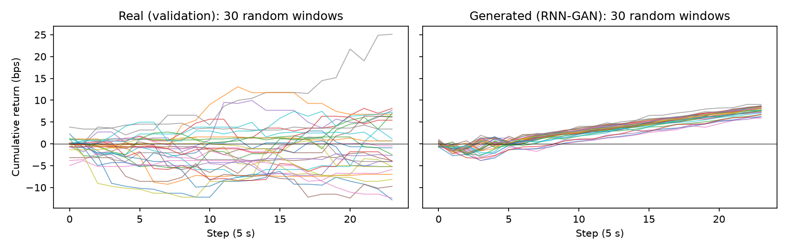

# TimeGAN for Synthetic Limit Order Books (AMZN, LOBSTER)

**COMP3710 Pattern Recognition, Project 2.7 (Time-Series Generation) · Angus Slater (s4961587)**

> **Status: working draft / lab notebook.** This file tracks what has been built, decided and measured so far.
> Sections marked **TODO** still need writing. Explanatory prose will be rewritten in my own words before submission.

---

## 1. Problem and engineering dilemma

Realistic limit order book (LOB) data is needed to stress-test trading and execution algorithms, but
high-frequency LOB data is expensive and licence-restricted. The goal is to generate **synthetic order books**
that look and behave like real ones.

Unlike generic time series, an order book must obey hard **microstructure invariants**:

- positive spread: best bid < best ask (otherwise the book is *crossed*, an instant risk-free arbitrage)
- monotonic price ladders across all 10 levels (asks increase away from the best ask, bids decrease)
- non-negative volumes
- realistic dynamics: volatility clustering, heavy-tailed returns

**Dilemma (spec §2.7):** does TimeGAN's joint supervised and adversarial loss actually learn these
constraints and dynamics better than a standard baseline generator, or does it produce plausible-looking
curves that break market structure, collapse to a few modes, or reduce to noise?

---

## 2. Repository layout

| File | Purpose | Status |
|---|---|---|
| `dataset.py` | LOBSTER loading, invariant audit, 5 s feature grid, chronological split, windowing | ✅ complete |
| `modules.py` | RNN-GAN baseline (GRU generator and discriminator); TimeGAN to come | 🟡 baseline only |
| `train.py` | Adversarial training loop, checkpoint and loss plot | 🟡 baseline only |
| `predict.py` | Load weights, generate windows, rebuild books, plots | ⬜ TODO |
| `utils.py` | `evaluate()` metrics and `to_book()` reconstruction (to be moved from notebook) | ⬜ TODO |
| `figures/` | Figures used in this README | 🟡 in progress |

Data and checkpoints are **not** committed (see `.gitignore`).

---

## 3. Data

**Source:** LOBSTER free sample, **AMZN, Level 10, 21 June 2012** (NASDAQ, 09:30–16:00).
Two files, joined row by row:

- **Message file** (6 columns): time (seconds after midnight), event type, order ID, size, price (USD × 10,000), direction.
  Event types: 1 submit, 2 partial cancel, 3 delete, 4 visible execution, 5 hidden execution, 6 cross, 7 halt.
- **Orderbook file** (40 columns): 10 levels × (ask price, ask size, bid price, bid size). Row *k* is the book
  **after** message *k*. There is no timestamp, so the time comes from the message file.

### 3.1 Data audit

| Check | Result |
|---|---|
| Rows (message = orderbook) | **269,748** in both files ✅ |
| Crossed books, ladder violations, negative sizes | **0** (`check_invariants`) |
| Empty-level dummy prices | **0** |
| Invariant checker validated on deliberately corrupted rows | ✅ catches each violation type (crossed 1, ask ladder 1, negative size 1 of 5 rows) |
| Spread (event level) | mean $0.131, median $0.13, min $0.01 (1 tick), max $0.77 |
| Mid-price range | $220.52–$226.03 (≈2.5% over the day) |
| Trades (executions) | 11,419 of 269,748 events (~4%), U-shaped through the day with a spike from 15:30–16:00 |
| Widest spreads | All 10 widest occur within **2.5 min of the open** (up to 77 ticks) |

**Implication:** real data never breaks an invariant, so any violation in synthetic data is the model's fault.

### 3.2 Limitations

- **One trading day only.** It gives 4,321 steps at 5 s, or roughly **120 independent 24-step windows**
  (overlapping windows are highly correlated). TODO: confirm with teaching staff whether more LOBSTER days are available.
- 2012 data on a single ticker; results may not transfer to other stocks or regimes.

---

## 4. Preprocessing decisions

| Decision | Choice | Evidence / reason |
|---|---|---|
| Session window | **09:45–15:45** (trim 15 min each end) | Widest spreads cluster in the first 2.5 min (book rebuilding after the open auction); trade spike at the close. Trimming removes auction-adjacent behaviour. |
| Time base | **5 s clock time** (not event time) | Zero mid-returns: event time **90.1%**, 1 s **≈71%**, 5 s **32.4%** (measured on the forward-filled grid). Too many zeros make return metrics trivially easy to "pass". 5 s gives 4,320 steps, comparable in scale to the stock dataset in the TimeGAN paper. |
| Resampling rule | Last book state at or before each grid time, forward-filled | The book is a step function between events. `label="right", closed="right"` ensures no grid value uses a later event (**no look-ahead**). |
| Price units | Integer LOBSTER units (USD × 10,000), 1 tick = 100 | Exact integer comparisons for invariant checks. |

---

## 5. Features (model input)

40 features per 5 s step, in a **mid-relative** representation:

| Feature | Count | Definition |
|---|---|---|
| `ret` | 1 | Log mid-price return, ln(mid_t / mid_{t−1}) (spec: log returns) |
| `spread` | 1 | (ask₁ − bid₁) in ticks, ≥ 1 in valid books |
| `ask_gap1–9` | 9 | ask_{i+1} − ask_i in ticks, ≥ 1 |
| `bid_gap1–9` | 9 | bid_i − bid_{i+1} in ticks, ≥ 1 |
| `ask_logv1–10`, `bid_logv1–10` | 20 | ln(1 + shares) per level (volume normalisation) |

**Why mid-relative instead of raw prices:**
- **Stationary:** shapes recur regardless of price level.
- **Lossless:** mid + spread + gaps rebuild every price.
- **Enforces the invariants by construction** if a model outputs positive spread and gaps.

TODO: test this against a raw-price representation (raw vs constrained arm).

Verified on the 5 s grid: 4,321 steps × 40 features, 0 missing values, min spread 1 tick, min gap 1 tick.

---

## 6. Splits, normalisation and windows

| Split | Time | Steps | Windows (24 steps, stride 1) |
|---|---|---|---|
| Train | 09:45–13:45 | 2,880 | 2,857 |
| Validation | 13:45–14:45 | 720 | 697 |
| Test | 14:45–15:45 | 721 | 698 |

- **Chronological split** (spec requirement): train on earlier hours, test on later hours.
- **z-score standardisation with training statistics only.** After scaling, train has mean 0 and std 1.
  Validation and test feature means drift up to **0.44** and **0.39** training standard deviations, quantifying the
  morning-to-afternoon distribution shift (and confirming no leakage).
- **Windows cut per split**, so no window crosses a split boundary. One window = 24 × 5 s = **2 minutes**.
- Training batches: (128, 24, 40), shuffled within the training period only.

---

## 7. Models

### 7.1 Baseline: RNN-GAN

GRU generator (noise → 24 × 40 window) and GRU discriminator (one real/fake logit per step), trained with
the non-saturating BCE GAN loss. Effectively **TimeGAN without its embedder, recovery and supervisor
networks**, so comparing the two isolates the contribution of TimeGAN's supervised temporal loss.

| Network | Parameters |
|---|---|
| Generator (GRU 2 × 64 + linear) | 47,912 |
| Discriminator (GRU 2 × 64 + linear) | 45,377 |

### 7.2 TimeGAN

TODO: embedder, recovery, supervisor, generator, discriminator; three-phase training (Yoon et al., 2019).

---

## 8. Experiments log

### Run 1: RNN-GAN baseline (unconstrained output)

**Settings:** 200 epochs (4,400 steps), batch 128, Adam lr 2e-4, betas (0.5, 0.999), BCE loss, seed 0.
**Hardware / time:** MacBook (CPU/MPS), **3 min 35 s**.

**Training dynamics:**
- epochs 0–70: discriminator dominance (D loss ≈ 0.1–0.2, G loss up to 7)
- epochs 80–120: the generator catches up
- epochs 130–199: losses near the coin-flip balance (D ≈ 1.2, G ≈ 0.8)

The samples below show that this balance reflects **mode collapse**, not success.

**697 generated windows vs 697 real validation windows (real units):**

| Metric | Real (val) | Generated | Verdict |
|---|---|---|---|
| Spread mean (ticks) | 11.38 | 8.95 | too tight |
| Spread std (ticks) | 3.60 | 1.85 | half the variability |
| Crossed books (spread ≤ 0) | 0% | 0.00% | ✅, but only because spreads sit far from 0 |
| Ladder gaps < 1 tick | 0% | **19.79%** | ❌ invalid ladders |
| 5 s return std (bps) | 1.507 | 0.713 | half the volatility |
| Mean 5 s return (bps) | −0.008 | **+0.326** | spurious upward drift |
| Windows trending up | ~50% expected | **100%** | ❌ directional collapse |
| Diversity: std across windows of mean spread | 1.61 | **0.16** | ❌ ~10× less diverse (mode collapse) |

**Failure modes identified (autopsy):**
1. **Missing discreteness:** smooth continuous drift instead of tick jumps and flat stretches (real data has 32% zero returns).
2. **Spurious drift:** every window trends up, ~+7.8 bps per 2 min. A momentum backtest on this data would show artificial profit.
3. **Invalid ladders at the boundary:** many real gaps are exactly 1 tick, so a continuous generator scatters ~half of them below the minimum; deep levels collapse onto each other.
4. **Static depth:** depth heatmaps show smooth horizontal bands, a single average book profile (mode collapse).
5. **Start-up transient:** the first ~3–5 generated steps differ from the rest as the GRU warms up from noise.




TODO: check the train-vs-val comparison (to separate model error from market drift).

---

## 9. Evaluation plan

All models are scored with the same code on real units (after inverting the normalisation):

- **Invariant audit:** % crossed books, ladder violations, negative volumes, **counted before any clipping or rounding**
- **KL divergence ≤ 0.1** on spread and 5 s mid returns (tick-aligned bins) (spec)
- **Fraction of zero returns** and **KL on non-zero returns**, so a "never moves" generator can't pass
- **Volatility clustering:** autocorrelation of |returns|
- **Depth-heatmap SSIM > 0.6** on 2-minute windows (spec)
- **Diversity** across windows (mode-collapse check)
- 3–5 real-vs-synthetic heatmap comparisons with failure autopsy

---

## 10. Resource profiling (so far)

| Model | Parameters | Hardware | Training time | Peak VRAM | Inference latency |
|---|---|---|---|---|---|
| RNN-GAN (Run 1) | 93,289 (G + D) | Mac CPU/MPS | 3 min 35 s | TODO (GPU) | TODO |
| TimeGAN | TODO | Rangpur A100 | TODO | TODO | TODO |

---

## 11. Usage and reproducibility

```bash
# Data: download the LOBSTER AMZN Level-10 sample to a folder outside the repo, e.g. ~/data/LOBSTER
python train.py --data_dir ~/data/LOBSTER --epochs 200
```

**Dependencies:** TODO (exact versions via `pip freeze`; Rangpur: PyTorch 2.13 + CUDA 13.0).
Seeds are fixed (`--seed 0`). Prices are kept as integers, so the invariant checks are exact.

---

## 12. Feasibility review (one page)

TODO. Sections:
- user need, scope and acceptance criteria
- model choice and course concepts
- preliminary evidence (§3.1 and Run 1)
- risks, budget and fallback

---

## 13. Recommendation to project manager

TODO, after TimeGAN results.

---

## 14. Artificial Intelligence Usage Disclosure

**Tools used:** Anthropic Claude (claude.ai chat and the Claude Code extension in Cursor).

**What AI assisted with:**
- explaining concepts (LOB microstructure, resampling and look-ahead, normalisation, GAN losses)
- discussing design options and their trade-offs
- writing draft code for `build_features`, `split_and_normalise`, `make_windows` / `get_data`, the RNN-GAN modules, `train.py`, and notebook evaluation snippets
- reviewing my own code for `find_lobster_files`, `load_raw` and `check_invariants`
- drafting this README skeleton

**How I verified it:**
- every function was run against expected outputs before committing (row counts, shapes, split sizes, normalised statistics)
- the invariant checker was tested on deliberately corrupted rows
- a resampling bug (a grid offset of 17 ms) was caught by an expected-length check and fixed
- I can explain every design decision recorded above

TODO: final review before submission.

---

## References

1. J. Yoon, D. Jarrett, M. van der Schaar, "Time-series Generative Adversarial Networks," *NeurIPS*, 2019.
2. Z. Zhang, S. Zohren, S. Roberts, "DeepLOB: Deep Convolutional Neural Networks for Limit Order Books," *IEEE Trans. Signal Processing*, 2019.
3. LOBSTER: Limit Order Book System, The Efficient Reconstructor. https://lobsterdata.com (sample files and ReadMe).
